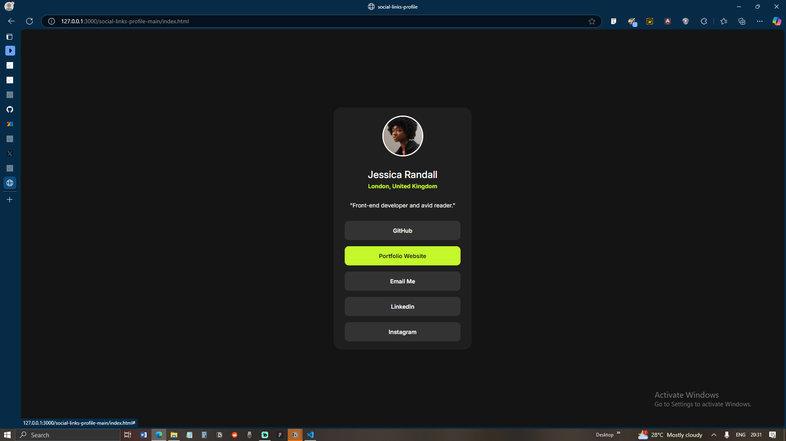

# social-links-profile

# Frontend Mentor - Social links profile solution

This is a solution to the [Social links profile challenge on Frontend Mentor](https://www.frontendmentor.io/challenges/social-links-profile-UG32l9m6dQ). Frontend Mentor challenges help frontend developers improve their coding skills by building realistic projects. 

## Overview

### The challenge

Users should be able to:

- See hover and focus states for all interactive elements on the page

### Screenshot



### Built with

- HTML
- CSS
- CSS Flexbox

### What I learned

Using 'border-radius: inherit;' in my CSS was useful for making sure the image fit correctly within its parent div.

I used variables for the first time:

```css
:root {
    --background-color: hsl(0, 0%, 8%);
    --wrapper-color: hsl(0, 0%, 12%);
    --links-color: hsl(0, 0%, 20%);
    --text-color: hsl(0, 0%, 100%);
    --secondary-color: hsl(75, 94%, 57%);
}
```

I've known about them for some time but this was my first time applying them in a project. I can see why people use variables in CSS. It helps with reusability, especially if there are project styles.

## Author

- All social links are on my Github profile (https://github.com/subjectiverealityy)

- You can always search for this repository there by typing out 'social-links-profile' in the search bar of my profile page.
